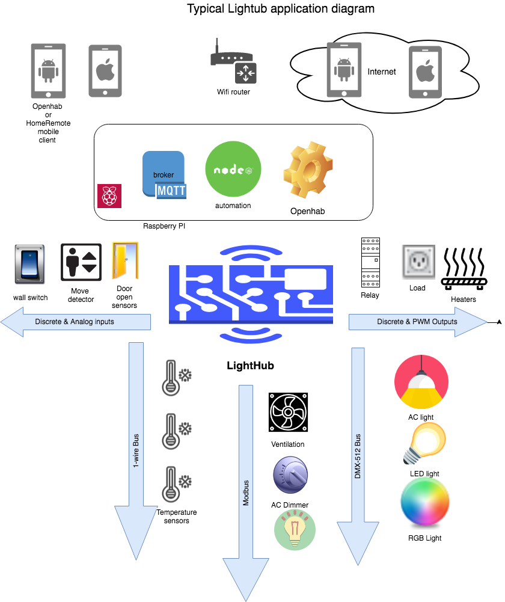

# LightHub 
is Flexible, Arduino-Mega/Arduino DUE/ESP8266  based SmartHome controller. [RU](https://geektimes.ru/post/295109/)

It allows connecting together:

* Contact sensors (switches, buttons etc)
* 1-Wire temperature sensors (up to 20 on single bus)
* Standard nonexpensive Relay board with TTL inputs, [like this](https://aliexpress.com/item/16-Channel-20A-Relay-Control-Module-for-Arduino-UNO-MEGA2560-R3-Raspberry-Pi/32747887693.html) to control AC powered lamps, floor heaters, boilers etc
* [Standard nonexpensive LED dimmers](https://aliexpress.com/item/30-channel-27channel-Easy-DMX-LED-controller-dmx-decoder-driver-rgb-led-controller/2015743918.html) and [AC DMX-512 dimmers](https://aliexpress.com/item/DMX302-led-DMX-triac-dimmer-brightness-controller-AC90V-240V-Output-3channels-1A-CH-High-voltage-led/32822841266.html)
* Modbus RTU devices (Currently, are deployed two types of Modbus devices: AC Dimmer and Ventilation set (Based on [Vacon 10 controller](http://files.danfoss.com/download/Drives/Vacon-10-Quick-Guide-DPD00714F1-UK.pdf))
* Simple DMX wall sensor panel [like this](https://aliexpress.com/item/New-Ltech-D8-LED-rgb-RGBW-touch-panel-controller-DMX512-controller-DC12-24V-4-zones-4/32800199589.html)



Where is possible both, to configure local control/mapping between inputs and outputs (light, floor heating thermostats) and remote control from MQTT enabled software. At the moment, tested:
* [Openhab or Openhab2 Smarthome software](http://www.openhab.org/)
Openhab provides own native mobile app both, for IoS and Android, requires some server to be installed (Raspberry PI good enough)
* [HomeRemote mobile client](http://thehomeremote.com/)
Home Remote mobile applicatios for IoS and Android requires only MQTT broker to be working. Any Cloud-based MQTT broker, like [CloudMQTT](https://www.cloudmqtt.com/) is good enough to serve average household, even with free account. 
* [Node-Red](https://nodered.org/)  Possibly, the best solution to deploy event-based authomation and scripting on top of MQTT/LightHub. The easy to use universal and visual tool to wire many different devices in single system.

Scalability is virtually unlimited: Setup so many controllers you needed in most convenient places of your house - MQTT broker will allow controllers communicate each other and with Openhab/NodeRed/HomeRemote and propagate commands across network.

[Prease refer to our Wiki for insructions.](https://github.com/anklimov/lighthub/wiki/Configuring)

Finished portation of project to  Arduino DUE and ESP8266 (ESP32 not tested).

Compiled image  has been added to [compiled/](https://github.com/anklimov/lighthub/tree/master/compiled) folder. Flash your Mega 2560

```bash
avrdude  -v -V -patmega2560 -cwiring -b115200 -D -Uflash:w:lighthub.ino.hex:i
```

or flash your DUE (need to correct path and port, of course)
```bash
/Users/<user>/Library/Arduino15/packages/arduino/tools/bossac/1.6.1-arduino/bossac -i -d --port=cu.usbmodem1451 -U false -e -w -v -b lighthub.ino.bin -R
```
Note: binary images usually not up-to-date with recent code. The preferred way, to compile and upload firmware to your controller.

# Dependencies
(quite big number of libs required. Use git clone to have your local copy in your Arduino libs folder)
Please check updates for all dependences.

For patched libraries, appropriate GitHub repo URL provided:

* Arduino-Temperature-Control-Library   https://github.com/anklimov/Arduino-Temperature-Control-Library
* DS2482_OneWire                        https://github.com/anklimov/DS2482_OneWire
* FastLED
* Wire (standard)
* Artnet				                https://github.com/anklimov/Artnet.git
* DmxSimple                             https://github.com/anklimov/DmxSimple (for AVR) or https://github.com/anklimov/ESP-Dmx (for ESP) or https://github.com/anklimov/DmxDue (for DUE)
* HTTPClient (for AVR)                  https://github.com/anklimov/HTTPClient or https://github.com/arduino-libraries/ArduinoHttpClient for other platforms
* aJson                                 https://github.com/anklimov/aJson
* CmdArduino                            https://github.com/anklimov/CmdArduino
* EEPROM (standard for AVR) or DueFlashStorage for DUE
* ModbusMaster                          https://github.com/anklimov/ModbusMaster
* pubsubclient-2.6
* DMXSerial-master (for AVR)            https://github.com/anklimov/DMXSerial
* Ethernet                              https://github.com/anklimov/Ethernet
* SPI (standard)

Portation from AVR Mega 2560 to SAM3X8E (Arduino DUE) done since v 0.96

# Platforms specific details:

AVR version is basic and has all functions
*DMX-out is software (DMXSimple) on pin3

**SAM3X8E**:
* default PWM frequency
* both, DMX-in and DMX-out are hardware USART based. Use USART1 (pins 18 and 19) for DMX-out and DMX-in

**ESP8266**:
* DMX-OUT on USART1 TX
* DMX-IN - not possible to deploy in ESP8266
* Modbus - disabled. Might be configured in future on USART0 instead CLI/DEBUG

since v. 0.97:

There is first attempt to use Wiznet 5500  (still not stable enough)
Need to use compiler directive -D Wiz5500 and https://github.com/anklimov/Ethernet2 library

Prefered way to compile project is using platformio toolchain, suitable for Arduino Due, and Arduino Mega2560, but work is still in progress.

# Due compilation issue "USART0_Handler redefinition"
Please, open  /variants/arduino_due_x/variant.cpp file, then edit USART0_Handler method definition like this

void USART0_Handler(void)  __attribute__((weak));

# Platformio command line build instructions
[First of all install platformio framework.]( http://docs.platformio.org/en/latest/installation.html)  [Good tutorial for fast start in RUSSIAN.](https://geektimes.ru/post/273852/)

In linux\OSX you can open terminal, navigate to your programming directory, then

```bash
 git clone https://github.com/anklimov/lighthub.git
 cd lighthub
 ```
now prepare project files for your IDE
```bash
pio init --ide [atom|clion|codeblocks|eclipse|emacs|netbeans|qtcreator|sublimetext|vim|visualstudio|vscode]
```
Set custom build flags. first make your own copy of template
```bash
cp build_flags_template.sh my_build_flags.sh
```
then edit, change or comment unnecessary sections and source it
```bash
nano my_build_flags.sh
source my_build_flags.sh
```
build and upload firmware for due|megaatmega2560|esp8266 board
```bash
pio run -e due|megaatmega2560|esp8266 -t upload
```
Clean pio libraries folder. Try it if you have compilation problem:
```bash
rm -Rf .piolibdeps
```
open COM-port monitor with specified baud rate
```bash
platformio device monitor -b 115200
```

# Custom build flags

* MY_CONFIG_SERVER=192.168.1.1 // address of external JSON-config http://192.168.1.1/de-ad-be-ef-fe-00.config.json
* WATCH_DOG_TICKER_DISABLE //disable wdt feature
* USE_1W_PIN=49 // use direct connection to 1W devices on 49 pin, no I2C bridge DS2482-100
* SD_CARD_INSERTED // enable sd-card support and fix lan starting
* SERIAL_BAUD=115200 // set baud rate for console on Serial0
* Wiz5500 //Use Wiznet 5500 library instead Wiznet 5100
* DISABLE_FREERAM_PRINT // disable printing free Ram in bytes
* CUSTOM_FIRMWARE_MAC=de:ad:be:ef:fe:00 //set firmware macaddress
* DMX_DISABLE //disable DMX support
* MODBUS_DISABLE // disable Modbus support
* OWIRE_DISABLE // disable OneWire support
* ARTNET_ENABLE //Enable Artnet protocol support


# Default compilation behavior:
* Config server: lazyhome.ru
* Watchdog enabled
* 1-Wire communication with DS2482-100 I2C driver
* No SD
* Serial speed 115200
* Wiznet 5100 (for MEGA & DUE)
* Free Ram printing enabled
* de:ad:be:ef:fe:00
* DMX support enabled
* Modbus support enabled
* OneWire support enabled
* Artnet disabled
* Defailt MQTT input topic: /myhome/in
* Default MQTT topic to publish device status: /myhome/s_out
* Default Alarm output topic /alarm

If you've using Arduino IDE to compile & flash firmware, you will not able to configure compilers options except edit "options.h" file

